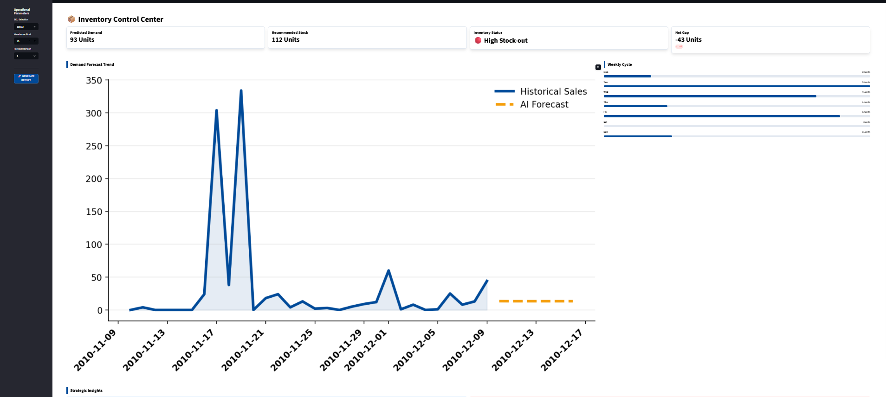

# 📦 Smart Inventory Optimization System

## 📖 Overview

This project is an end-to-end Machine Learning system designed to predict product demand and optimize inventory decisions.

Unlike traditional forecasting models that only predict future demand, this system provides actionable inventory recommendations to help businesses maintain optimal stock levels while minimizing stock-outs and overstock situations.

## 🎯 Problem Statement

Businesses often face two major inventory challenges:

* 📉 Stock-outs, resulting in lost sales and dissatisfied customers.
* 📦 Overstocking, leading to increased inventory holding costs.

This system addresses both challenges by combining demand forecasting with inventory optimization.

## ✨ Features

* 📈 Demand forecasting for 7-day and 30-day periods
* ⚠️ Stock-out risk detection
* 📦 Overstock detection
* ✅ Recommended stock calculation with a safety buffer
* 📊 Demand trend visualization
* 📅 Weekly demand pattern analysis
* 💡 Automated business insights and recommendations

## 🛠️ Technology Stack

* Python
* Pandas
* Scikit-learn
* Streamlit
* Matplotlib

## 🧠 Machine Learning Approach

The forecasting model uses:

* Time-based features (Day, Month, Day of Week)
* Lag features (Lag-1, Lag-7)
* Rolling statistics (Rolling Mean and Rolling Standard Deviation)
* Iterative forecasting for future demand prediction

## 🖥️ Dashboard

An interactive dashboard built using Streamlit enables users to:

* Select a product
* Enter the current inventory level
* Choose the forecasting period
* View demand predictions
* Receive inventory recommendations and business insights

## 📸 Demo



## 🚀 How to Run

Install the required dependencies:

```bash
pip install -r requirements.txt
```

Run the Streamlit application:

```bash
streamlit run app.py
```

## 🔮 Future Enhancements

* Multi-product inventory optimization
* Real-time sales data integration
* Advanced forecasting models (LSTM, XGBoost, Prophet)
* Cloud deployment
* Supplier lead-time optimization
* Interactive analytics dashboard

## 📄 License

This project was developed for educational and learning purposes.
